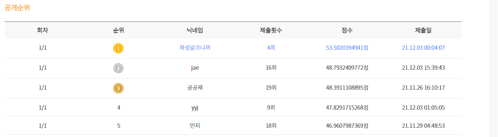

# [AI 텍스트 요약 알고리즘 개발 대회 AI Factory](http://aifactory.space/competition/detail/1923)

## 팀원
|김다인|박성호|박재형|
| :---: | :---: | :---: |
| <a href="https://github.com/danny980521" height="5" width="10" target="_blank"> | <a href="https://github.com/naem1023" height="5" width="10" target="_blank">| <a href="https://github.com/Jay-Ppark" height="5" width="10" target="_blank">|

## 주제
- 텍스트 기반의 문서를 요약하는 알고리즘을 개발하고 요약텍스트 데이터를 활용해 도출한 결과물을 통해 데이터의 범용성 확대  
## Solution
- KoBART : 33.26  
- KoGPT2(SKT-AI), KoGPT(Kakao brain) : 요약결과가 좋지 않아서 제출X  
- Brainbert-base(Pororo) : 46.56 ~ 48.35  
- Brainbert-base(Pororo) + 전처리(유니코드 제거 + 따옴표 제거) : Best Score : 48.79

## 최종 순위
- **2위**
   

## 느낀점
- **김다인** : Pororo Library가 굉장히 잘 만들어져있음을 느낄 수 있는 대회였다. 시간이 된다면 내부 깃헙 코드를 하나씩 들여다보며 내부 모델들의 구조를 통해 공부하고 싶다.
- **박성호** : 여러 Generation model을 summarizatino에 활용한 것은 처음이었다. Decoder만을 활용한 Transformer들로도 Summarization을 잘 해보고 싶었는데 아쉬웠다.
- **박재형** : Generation model을 이용해서 좋은 점수를 얻고 싶었지만 실패해서 많이 아쉬웠다. 뽀로로 extractive가 정말 좋다는 것을 알게 되었다. 좀 더 공부해서 Generation model로 더 좋은 성적을 내보고 싶다.  
